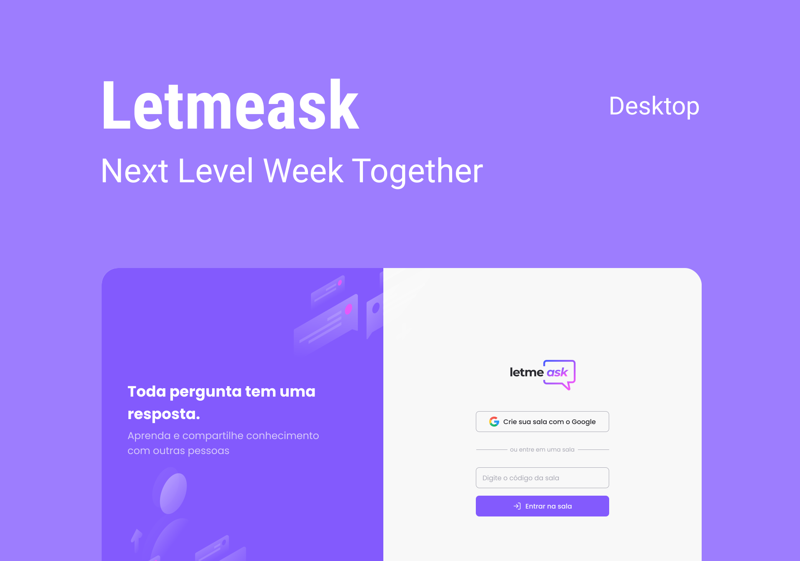

# LetmeAsk-App
Project developed in reactJs, through NLW classes on the rocketseat platform.

<h1 align="center">
    
</h1>

# This project is hosted on github pages
  (https://phlima3.github.io/LetmeAsk-App/)
